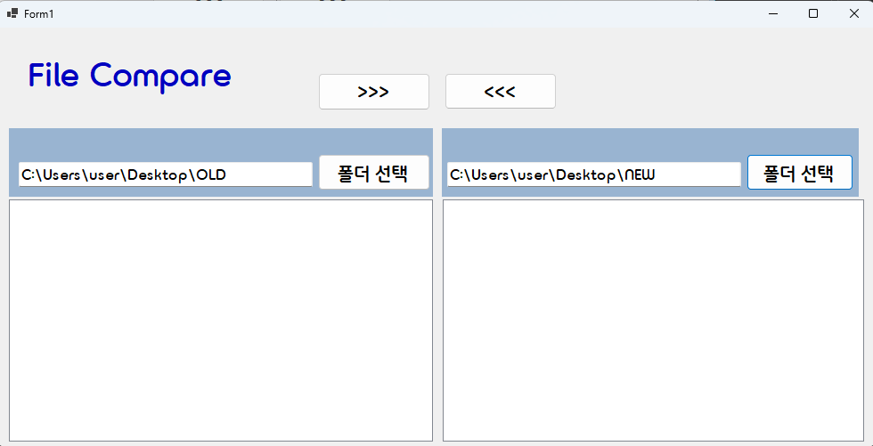
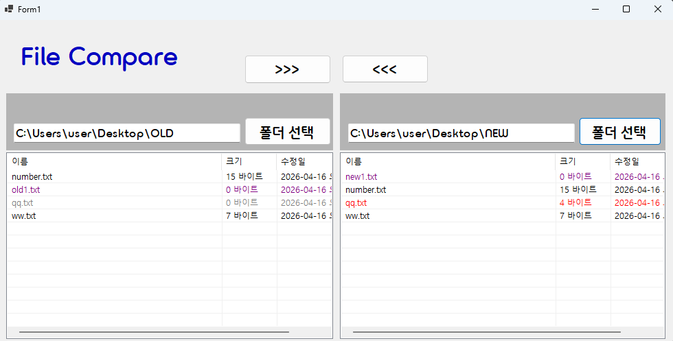
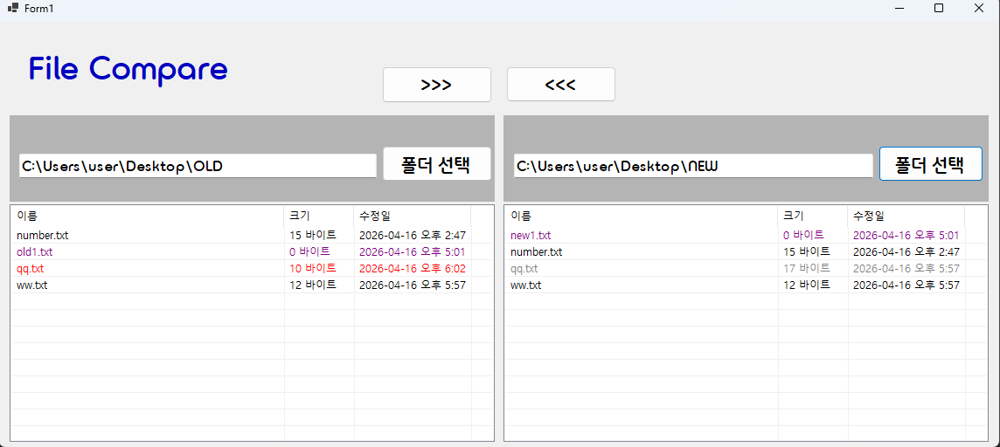
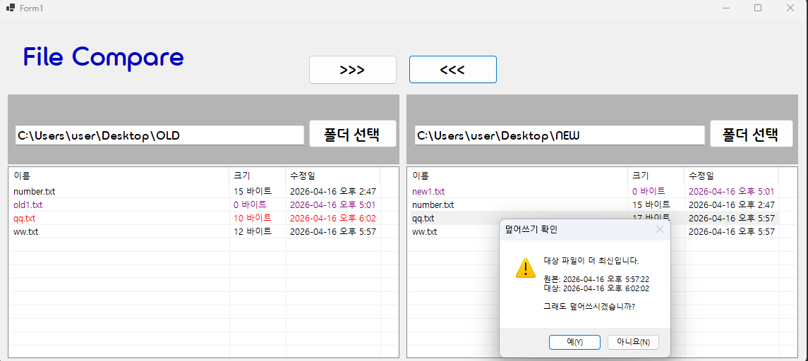
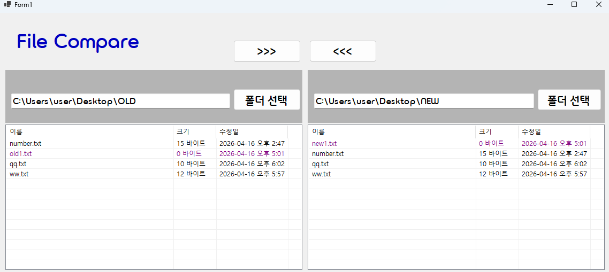
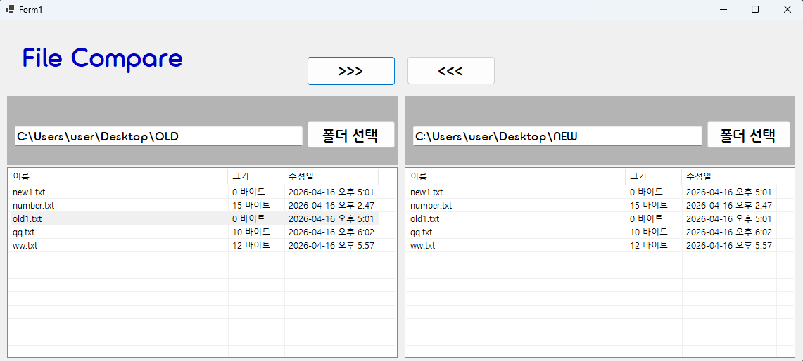

# (C# 코딩) 에코 메신저

## 개요
- C# 프로그래밍 학습

- 1줄 소개: 사용자 키보드 입력을 받아서 처리하는 프로그램

- 사용한 플랫폼:
  - C#, .NET Windows Forms, Visual Studio, GitHub

- 사용한 컨트롤:
  - Label, TextBox, Button, SplitContainer, Panel, ListView

- 사용한 기술과 구현한 기능:
  - Visual Studio를 이용하여 UI 디자인
  - 파일 비교 앱 구현, 2개 폴더 안에 담긴 파일을 비교
  - 파일 비교 결과를 색상으로 표시
  - 파일 비교 결과를 ListView에 표시
  - 파일 복사 기능 구현

## 실행 화면 (과제1)
- 코드의 실행 스크린샷과 구현 내용 설명

- 구현한 내용 (위 그림 참조)
  - UI 구성 : Label(앱 이름 표시), TextBox 2개, SplitContainer, Panel, ListView
  - 폴더 선택 버튼을 통해 폴더 선택시 텍스트 박스에 경로 표시 

## 실행 화면 (과제2)
- 코드의 실행 스크린샷과 구현 내용 설명

- 구현한 내용 (위 그림 참조)
  - 폴더선택기능과파일리스트기능구현(색상구분표시)
  - 폴더 선택을 통해 정한 파일에 있는 내용들을 리스트 뷰에 표시
  - 양쪽의 파일을 비교하여 둘다 있으면 검은색, 한곳에만 있으면 보라색, 날짜가 다르면 최근은 빨간색, 옛날은 회색으로 표시된다.

## 실행 화면 (과제3)
- 코드의 실행 스크린샷과 구현 내용 설명

- 구현한 내용 (위 그림 참조)
  - 양쪽폴더사이에서파일의복사기능구현
  - 선택한파일을반대쪽폴더로복사하기
  - 수정된날짜정보를확인해서“확인” 받아진행여부결정하기
  - 옛날 파일을 최근 변경된 같은 파일에 덮어쓰려 할떄 확인창을 보여 실수가 일어나지 않도록 함

